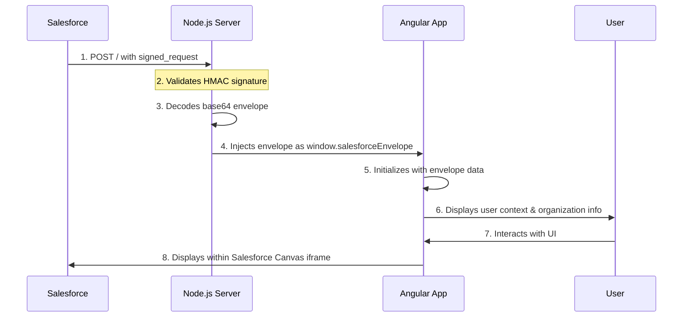

# Salesforce Canvas Integration - Angular + Node.js

A full-stack application that demonstrates Salesforce Canvas integration using Node.js (Express) backend and Angular frontend. This application securely handles Salesforce Canvas signed requests and displays user information within Salesforce.

## Features

- Salesforce Canvas Integration
- Secure request handling with HMAC SHA-256
- Angular 17+ with standalone components
- Docker containerization support
- Azure deployment ready
- TypeScript support
- Environment configuration

## Project Structure

```
/
├── back/              # Backend source (Node.js/Express)
│   ├── app.js        # Main server file
│   └── views/        # View templates
├── front/            # Frontend source (Angular)
│   ├── src/         # Angular source code
│   └── dist/        # Build output
├── .env.example     # Environment variables template
├── .gitignore      # Git ignore rules
├── deploy.sh       # Azure deployment script
├── Dockerfile      # Docker configuration
└── README.md       # Documentation
```

## Sequence Flow



## Prerequisites

- Node.js >= 18.x
- npm >= 8.x
- Angular CLI
- Docker (for containerization)
- Azure CLI (for cloud deployment)
- Salesforce Developer Account

## Local Development Setup

1. Clone the repository:
   ```bash
   git clone https://github.com/diegomejiaio/nodeserver-angular-salesforce-canvas-webapp.git
   cd nodeserver-angular-salesforce-canvas-webapp
   ```

2. Set up environment variables:
   ```bash
   cp .env.example .env
   # Edit .env with your actual values
   ```

3. Install dependencies:
   ```bash
   # Backend dependencies
   cd back
   npm install
   
   # Frontend dependencies
   cd ../front
   npm install
   ```

4. Run the application using the helper script:
   ```bash
   # From project root
   ./localrun.sh
   # Choose 'l' for local development mode
   ```

## Development Options

### Option 1: Simplified Local Development

This method runs both backend and frontend from a single command:

```bash
# From project root
./localrun.sh
# Choose 'l' for local development
```

The application will be available at http://localhost:3000

### Option 2: Docker Container (Production-like)

To run the application in a Docker container (simulating production):

```bash
# From project root
./localrun.sh
# Choose 'd' for Docker mode
```

The application will be available at http://localhost:3000

### Option 3: Separate Frontend and Backend (Advanced Development)

Run backend and frontend separately for more granular control:

```bash
# Backend
cd back
npm run dev  # Runs on port 3000

# Frontend (in another terminal)
cd front
ng serve     # Runs on port 4200
```
- Backend: http://localhost:3000

## Docker Deployment

Build and run the application using Docker:

```bash
docker build -t sf-canvas-angular .
docker run -p 3000:3000 -e CANVAS_CONSUMER_SECRET=your_secret sf-canvas-angular
```

## Azure Deployment

1. Ensure Azure CLI is installed and you're logged in:
   ```bash
   az login
   ```

2. Run the deployment script:
   ```bash
   chmod +x deploy.sh
   ./deploy.sh
   ```

The script will:
- Create/use Azure Container Registry (ACR)
- Build and push the Docker image
- Create an App Service Plan
- Deploy to Azure App Service
- Configure environment variables


## Environment Variables

Required environment variables in `.env`:

- `CANVAS_CONSUMER_SECRET`: Salesforce Canvas consumer secret
- `PORT`: Server port (defaults: 3000 for development, 80 for production)


## Security

- Implements HMAC SHA-256 signature validation for Salesforce Canvas requests
- Uses secure environment variables for sensitive data
- Implements proper CORS and security headers

## Contributing

1. Fork the repository
2. Create a feature branch
3. Commit your changes
4. Push to the branch
5. Submit a Pull Request

## License

MIT

## Support

For issues and feature requests, please use the GitHub issue tracker.

## Azure API Management (APIM) Integration

The application includes functionality to interact with Azure API Management (APIM) endpoints using the authenticated Salesforce user's bearer token. 

### APIM Features

- Make authenticated API calls to Azure API Management endpoints
- Uses the Salesforce OAuth token for authentication
- Configurable APIM host, endpoint, and subscription key
- Support for multiple HTTP methods (GET, POST, PUT, DELETE, etc.)
- Server-side proxy option to avoid CORS issues

### CORS Handling

When making direct browser-to-APIM calls, you may encounter CORS (Cross-Origin Resource Sharing) issues. The application provides two ways to handle this:

1. **Browser-side with `mode: 'no-cors'`**: This approach sends the request directly from the browser but won't be able to read the response details due to browser security.

2. **Server-side proxy**: The application includes a server-side proxy endpoint that makes the APIM call from the Node.js server, avoiding CORS issues altogether.

### APIM Configuration

Configure your APIM settings in the UI:

- **APIM Host**: The hostname of your APIM instance (e.g., `myapim.azure-api.net`)
- **APIM Endpoint**: The API endpoint path (e.g., `/api/data`)
- **Subscription Key**: Your APIM subscription key for authentication
- **HTTP Method**: Select the appropriate HTTP method for your API call
- **Use Server Proxy**: Toggle between direct browser requests and server-side proxy

### Server Proxy Implementation

The Node.js server includes a proxy endpoint at `/api/proxy` that forwards requests to APIM, adding the necessary headers and handling the response.

```javascript
// Example server proxy request
const response = await fetch('/api/proxy', {
  method: 'POST',
  headers: {
    'Content-Type': 'application/json'
  },
  body: JSON.stringify({
    apimHost: 'myapim.azure-api.net',
    apimEndpoint: '/api/data',
    method: 'GET',
    subscriptionKey: 'your-subscription-key',
    token: 'oauth-token-from-salesforce'
  })
});
```