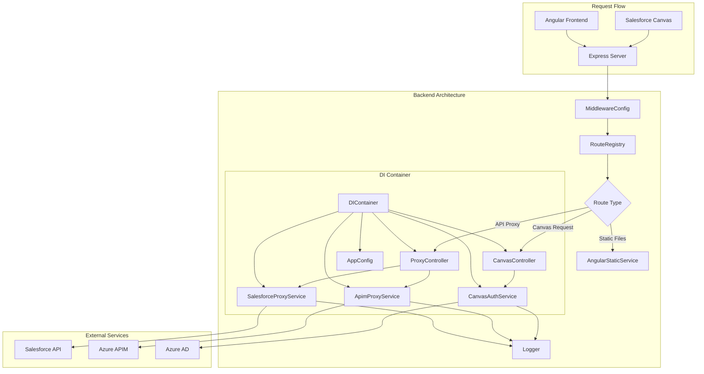
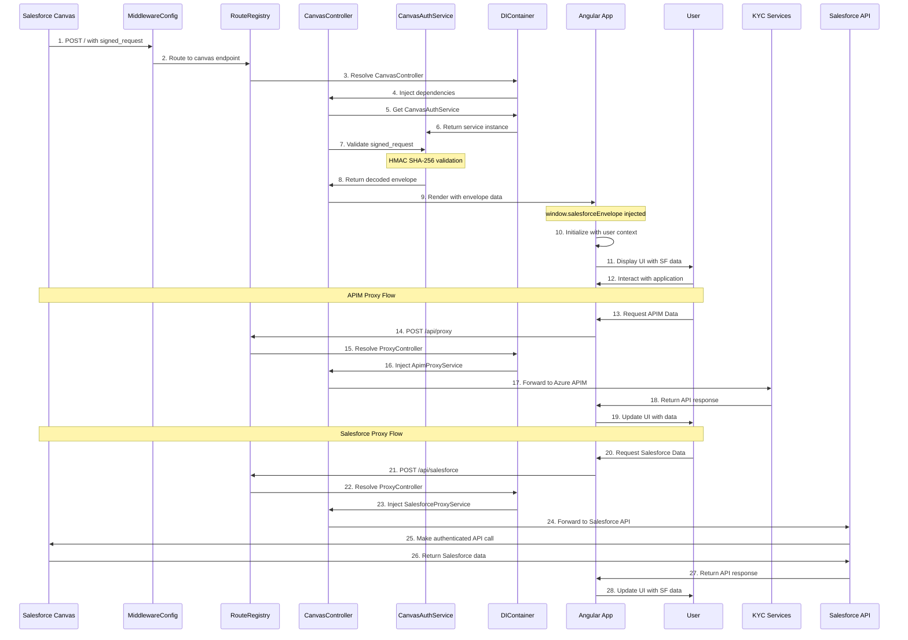

# Salesforce Canvas Integration - Angular + Node.js

A full-stack application that demonstrates Salesforce Canvas integration using Node.js (Express) backend and Angular frontend. This application securely handles Salesforce Canvas signed requests and displays user information within Salesforce.

## Features

- Salesforce Canvas Integration
- Secure request handling with HMAC SHA-256
- Angular 17+ with standalone components
- Docker containerization support
- Azure deployment ready
- TypeScript support
- Environment configuration

## Project Structure

```
/
├── back/              # Backend source (Node.js/Express)
│   ├── app.js        # Main server file
│   ├── README.md     # 📖 Backend Documentation
│   ├── src/          # SOLID architecture implementation
│   │   ├── config/   # Configuration management
│   │   ├── services/ # Business logic services
│   │   ├── controllers/ # HTTP request handlers
│   │   ├── middleware/  # Express middleware
│   │   ├── routes/   # Route definitions
│   │   └── container/ # Dependency injection
│   └── views/        # View templates
├── front/            # Frontend source (Angular)
│   ├── src/         # Angular source code
│   └── dist/        # Build output
├── .env.example     # Environment variables template
├── .gitignore      # Git ignore rules
├── deploy.sh       # Azure deployment script
├── Dockerfile      # Docker configuration
└── README.md       # Documentation
```

## Backend Architecture

The Node.js backend follows SOLID principles with a modular architecture. For detailed backend documentation, see **[Backend README](./back/README.md)**.



## Sequence Flow



## Prerequisites

- Node.js >= 18.x
- npm >= 8.x
- Angular CLI
- Docker (for containerization)
- Azure CLI (for cloud deployment)
- Salesforce Developer Account

## Local Development Setup

1. Clone the repository:
   ```bash
   git clone https://github.com/diegomejiaio/nodeserver-angular-salesforce-canvas-webapp.git
   cd nodeserver-angular-salesforce-canvas-webapp
   ```

2. Set up environment variables:
   ```bash
   cp .env.example .env
   # Edit .env with your actual values
   ```

3. Install dependencies:
   ```bash
   # Backend dependencies
   cd back
   npm install
   
   # Frontend dependencies
   cd ../front
   npm install
   ```

4. Run the application using the helper script:
   ```bash
   # From project root
   ./localrun.sh
   # Choose 'l' for local development mode
   ```

The application will be available at http://localhost:3000


## Docker Deployment

Build and run the application using Docker:

```bash
docker build -t sf-canvas-angular .
docker run -p 3000:3000 -e CANVAS_CONSUMER_SECRET=your_secret sf-canvas-angular
```

## Azure Deployment

1. Ensure Azure CLI is installed and you're logged in:
   ```bash
   az login
   ```

2. Run the deployment script:
   ```bash
   chmod +x deploy.sh
   ./deploy.sh
   ```

The script will:
- Create/use Azure Container Registry (ACR)
- Build and push the Docker image
- Create an App Service Plan
- Deploy to Azure App Service
- Configure environment variables


## Environment Variables

Required environment variables in `.env`:

- `CANVAS_CONSUMER_SECRET`: Salesforce Canvas consumer secret
- `PORT`: Server port (defaults: 3000 for development, 80 for production)


## Security

- Implements HMAC SHA-256 signature validation for Salesforce Canvas requests
- Uses secure environment variables for sensitive data
- Implements proper CORS and security headers

## Contributing

1. Fork the repository
2. Create a feature branch
3. Commit your changes
4. Push to the branch
5. Submit a Pull Request

## License

MIT

## Support

For issues and feature requests, please use the GitHub issue tracker.